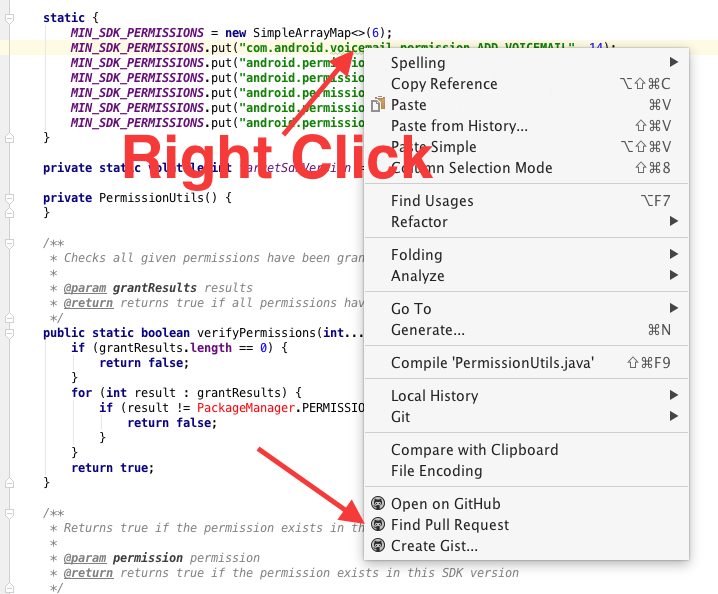

# find-pull-request

[](https://github.com/shiraji/find-pull-request/blob/master/LICENSE)

Intellij plugin that jumps to the pull request page (or GitHub commits page)

## How to use

* Select/Choose a line
* Right click
* Click "Find Pull Request"



* Open the pull request page if the plugin finds pull request
* Open the commit page if no pull request found for the selected line

## Requirement

* Remote repo should be GitHub/GitHub Enterprise
* Do not select multiple lines
* Project that has multiple git repository may not work

## How to install

Use the IDE's plugin manager to install the latest version of the plugin.

or

[Download](https://github.com/shiraji/find-pull-request/blob/master/find-pull-request.zip?raw=true) jar file and then go to Preferences > Plugins > Install plugin from disk... > Select the jar file you downloaded

## License

```
Copyright 2016 Yoshinori Isogai

Licensed under the Apache License, Version 2.0 (the "License");
you may not use this file except in compliance with the License.
You may obtain a copy of the License at

   http://www.apache.org/licenses/LICENSE-2.0

Unless required by applicable law or agreed to in writing, software
distributed under the License is distributed on an "AS IS" BASIS,
WITHOUT WARRANTIES OR CONDITIONS OF ANY KIND, either express or implied.
See the License for the specific language governing permissions and
limitations under the License.
```
