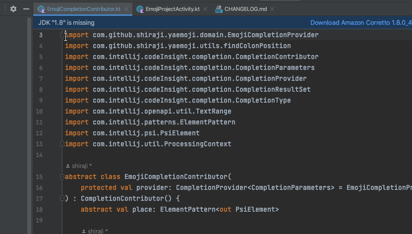

# find-pull-request

[](https://github.com/shiraji/find-pull-request/blob/main/LICENSE)
[](http://android-arsenal.com/details/1/3353)
[](https://plugins.jetbrains.com/plugin/8262-find-pull-request)
[](https://plugins.jetbrains.com/plugin/8262-find-pull-request)


Intellij plugin that jumps to the pull request page or commits page. This plugin supports GitHub, GitLab, Bitbucket.

## How to use

### Find Pull Request

* Select/Choose a line
* Right click
* Click "Open In | Pull Request"



* Open the pull request page if the plugin finds pull request
* Open the commit page if no pull request found for the selected line

### Copy Pull Request URL

* Select/Choose a line
* Right click
* Click "Copy / Paste Special | Copy Link to Pull Request"


### List Pull Request

* Right click editor's left part (Editor Gutter)
* Click "List Pull Request"


* This plugin lists PR number and commit hash if no PR found
* Click PR number jump to PR page
* Click commit hash jump to commit page

## Options

This plugin automatically detects which hosting service this project is hosted when the project open.

You can change "Hosting Service" setting in Preferences.


Unchecking "Jump to File when PR page open" will jump to the discussion page of the PR.

## Requirement

* Remote repo should be GitHub/GitLab/Bitbucket
* Custom domain should work but not tested it
* Repository must set upstream or origin remote url
 * if upstream is set, then use upstream remote url
* Selecting multiple lines is not supported
* Project that has multiple git repository may not work

## How to install

Use the IDE's plugin manager to install the latest version of the plugin.

## License

```
Copyright 2019 Yoshinori Isogai

Licensed under the Apache License, Version 2.0 (the "License");
you may not use this file except in compliance with the License.
You may obtain a copy of the License at

   http://www.apache.org/licenses/LICENSE-2.0

Unless required by applicable law or agreed to in writing, software
distributed under the License is distributed on an "AS IS" BASIS,
WITHOUT WARRANTIES OR CONDITIONS OF ANY KIND, either express or implied.
See the License for the specific language governing permissions and
limitations under the License.
```
